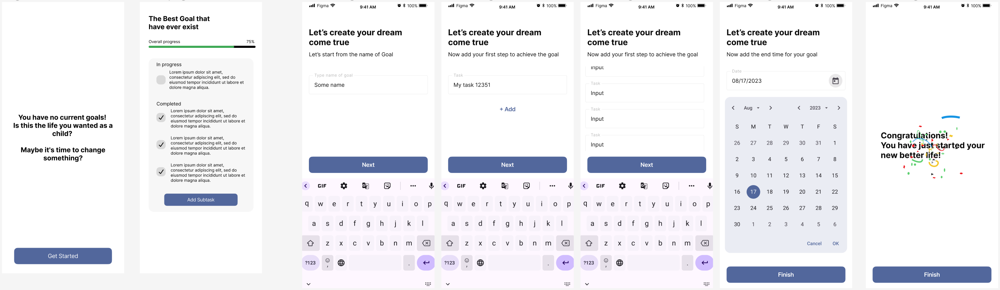

# Goal Destinator

### Goal Destinator is a project or other say application that can help you to achieve your goal.

### With the application you will be able to set the major goal for you life and track you progress with subtasks for your goal.

## Requirements for the app

The app should have 3 screens:

1. The first screen will use for the first opening or when user have no goal. This screen should
   contain motivational quote and the button for adding goal.
2. First screen and also known as main screen should have the title with the name of the goal,
   sublist of all tasks that goal should has and the button for adding new task to the list.
    1. On the screen all subtasks will be grouped by completion: the completed tasks will appear
       under unfinished.
    2. Unfinished task should be enabled for interaction. Once user press the task it should ask for
       completion comment.
    3. After user entered completion comment the task will appear in completed task list.
    4. The items in completed task list should not be active for interaction: only for displaying.
    5. The user cannot move completed task to incomplete.
3. The third screen, or better to say group of screens are "Goal creation" screens.
    1. First screen should have title centered on screen, field for entering goal name and the next
       button.
        1. The input must have limit of 5 words.
        2. If the input is empty and user pressed the next button, then error under the input should
           appears.
    2. The second screen will have field to enter first task for goal.
        1. Task input should have limit of 100 characters.
        2. Under the task input fields there should be the text button to add more tasks.
            1. By the clicking Add More button under input the entered task will appear above the
               input field as non-active text.
            2. Once user clicked the Add More button the application should check limit of
               characters and show error if check is not success.
        3. Also the screen should has the next button.
            1. Once user clicked the Next button the application should check if user entered at
               least one task. If so then the next screen will open.
    3. The third screen for adding goal should have the date input to choose the finish date for the
       goal.
        1. The minimum date must be tomorrow.
    4. The fourth screen is the confirmation and congratulation screen that confirm goal creation.
        1. The screen must disappear after 3 seconds.

## Design

You can find the design of project by
the [link](https://www.figma.com/file/AGjhLRHiixnb586ylBQ6dX/Goal-Destinator)

## APIs

The application uses [Quotable](https://github.com/lukePeavey/quotable) API for the launch screen or
screen with no goal.

## Technology stack

1. 